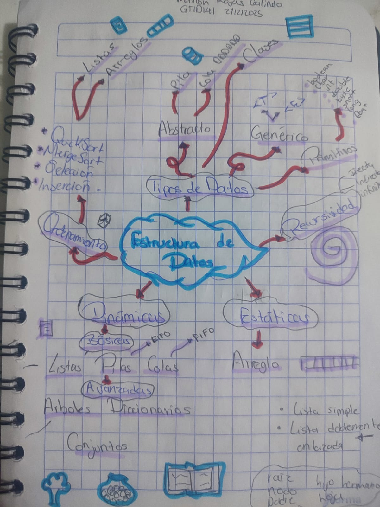
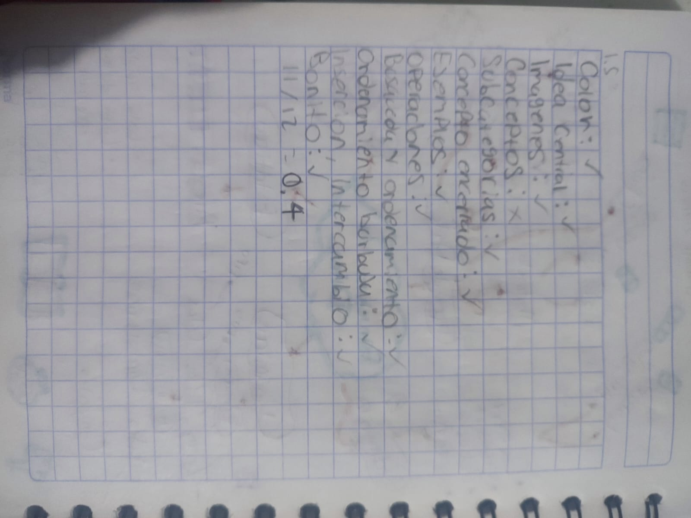

# ✨ Ejercicios Guiados y Prácticos (Unidad III) ✨

👤 **Nombre del estudiante:** *Marlon Rojas Galindo*  
🏫 **Grupo:** *GTID141*  
📘 **Materia:** *Estructura de Datos*  
📚 **Unidad:** *Unidad III: Estructura de Datos Avanzadas*  

---

## 📂 Ejercicios Guiados

### 📝 Ejercicio Guiado 1: Mi primera ventana en Swing

#### Código
| 📄 Nombre del archivo | 🧾 Descripción | 🔗 Enlace |
|-----------------------|----------------|-----------|
| `VentanaBasica.java` | Ventana básica con Swing | [Ver código](./Codigo/EjerciciosGuiados/primeraVentana/VentanaBasica.java) |
| `Main.java` | Ejecución de la ventana | [Ver código](./Codigo/EjerciciosGuiados/primeraVentana/Main.java) |

#### Documentos
| 📄 Nombre del archivo | 🧾 Descripción | 🔗 Enlace |
|-----------------------|-----------------|-----------|
| `EJEGUI1_VENTANA_SWING_MarlonRojas_GTID141.pdf` | Capturas de pantalla del ejercicio | [Ver documento](./Documentos/EjerciciosGuiados/EJEGUI1U3_VENTANA_SWING_MarlonRojasGalindo_GTID141.pdf) |

### 📝 Ejercicio Guiado 2: Nearpod Árboles

#### Documentos
| 📄 Nombre del archivo | 🧾 Descripción | 🔗 Enlace |
|-----------------------|-----------------|-----------|
| `EJEGUI2_NEARPOD_ARBOLES_MarlonRojas_GTID0141.pdf` | Capturas de pantalla de los ejercicios y apuntes de libreta | [Ver documento](./Documentos/EjerciciosGuiados/EJEGUI2U3_NEARPOD_ARBOLES_MarlonRojasGalindo_GTID0141.pdf) |

### 📝 Ejercicio Guiado 3: Árboles en Java

#### Documentos
| 📄 Nombre del archivo | 🧾 Descripción | 🔗 Enlace |
|-----------------------|-----------------|-----------|
| `EJEGUI3U3_ARBOLES_MarlonRojasGalindo.pdf` | Apuntes de libreta sobre los ejercicios | [Ver documento](./Documentos/EjerciciosGuiados/EJEGUI3U3_ARBOLES_MarlonRojasGalindo.pdf) |

#### Código
| 📄 Nombre del archivo | 🧾 Descripción | 🔗 Enlace |
|-----------------------|-----------------|-----------|
| `ArbolBinario.java`| Arbol binario implementado en Java | [Ver codigo](./Codigo/EjerciciosGuiados/arbolbinario/ArbolBinario.java) |
| `NodoArbol.java` | Nodo de un árbol implementado en Java | [Ver codigo](./Codigo/EjerciciosGuiados/arbolbinario/NodoArbol.java) |
| `PruebaArbol.java` | Clase de prueba de un Árbol binario en java | [Ver codigo](./Codigo/EjerciciosGuiados/arbolbinario/PruebaArbol.java) |

### 📝 Ejercicio Guiado 4: Nearpod Conjuntos
#### Documentos
| 📄 Nombre del archivo | 🧾 Descripción | 🔗 Enlace |
|-----------------------|-----------------|-----------|
| `EJEGUIA4U3_NEARPOD_CONJUNTOS_MarlonRojasGalindo.pdf` | Apuntes y capturas sobre el Nearpod de Conjuntos | [Ver documento](./Codigo/EjerciciosGuiados/arbolbinario/PruebaArbol.java) |

#### Código
| 📄 Nombre del archivo | 🧾 Descripción | 🔗 Enlace |
|-----------------------|-----------------|-----------|
| `Main.java` | Clase de preuba para implementar código de Nearpod | [Ver codigo](./Codigo/EjerciciosGuiados/conjunto/Main.java) |

### 📝 Ejercicio Guiado 5: Mapa Mental de la Materia
| Imagen | Descripción |
|--------|-------------|
|| Imagen del mapa mental |
| | Imagen de la calificación obtenida |

### 📝 Ejercicio Guiado 6: Nearpod Diccionarios
#### Documentos
| 📄 Nombre del archivo | 🧾 Descripción | 🔗 Enlace |
|-----------------------|-----------------|-----------|
| `EJEGUIA6U3_NEARPOD_DICCIONARIOS_MarlonRojasGalindo.pdf` | Apuntes y capturas sobre el Nearpod de Diccionarios | [Ver documento](./Documentos/EjerciciosGuiados/EJEGUI5U3_NEARPOD_DICCIONARIOS_MarlonRojasGalindo.pdf) |

---

## 🧪 Ejercicios Prácticos

### 💻 Ejercicio Práctico 1: Identificación de elementos de un Árbol

#### Documentos
| 📄 Nombre del ejercicio | 🧾 Descripción | 🔗 Enlace |
|-------------------------|----------------|-----------|
| `EJEPRA1_Identificacion_de_elementos_Arboles_MarlonRojas_GTID141.pdf` | Escaneo de las actividades en el cuaderno y calificación | [Ver Documento](./Documentos/EjerciciosPracticos/EJEPRA1_Identificacion_de_elementos_Arboles_MarlonRojas_GTID141.pdf) |

---

### 💻 Ejercicio Práctico 2: Simulador DOM con Árbol en Java Swing

Aplicación que simula la creación de una página web mediante un árbol DOM, mostrando la jerarquía de elementos HTML y su representación en código.

#### Código (Patrón MVC)
| 📄 Nombre del archivo | 🧾 Descripción | 🔗 Enlace |
|-----------------------|----------------|-----------|
| `NodoDOM.java` | Modelo - Representa cada nodo del árbol DOM | [Ver código](./Codigo/EjerciciosPracticos/Codigo_fuente/ejercicio01_dom/modelo/NodoDOM.java) |
| `ArbolDOM.java` | Modelo - Gestiona el árbol DOM completo | [Ver código](./Codigo/EjerciciosPracticos/Codigo_fuente/ejercicio01_dom/modelo/ArbolDOM.java) |
| `VistaDOMSimulador.java` | Vista - Interfaz gráfica con JTree y vista HTML | [Ver código](./Codigo/EjerciciosPracticos/Codigo_fuente/ejercicio01_dom/vista/VistaDOMSimulador.java) |
| `ControladorDOM.java` | Controlador - Lógica de operaciones | [Ver código](./Codigo/EjerciciosPracticos/Codigo_fuente/ejercicio01_dom/controlador/ControladorDOM.java) |
| `Main.java` | Clase principal de ejecución | [Ver código](./Codigo/EjerciciosPracticos/Codigo_fuente/ejercicio01_dom/Main.java) |

#### Video de demostración
| 🎬 Video | 🧾 Descripción |
|----------|----------------|
| [Ver video](https://youtu.be/lR8D9_nO4N0) | Demostración del funcionamiento del Simulador DOM |

#### Funcionalidades
- ✅ Visualización del árbol DOM con JTree
- ✅ Vista HTML sincronizada en tiempo real
- ✅ Agregar, eliminar y editar nodos
- ✅ Exportar HTML a archivo

---

### 💻 Ejercicio Práctico 3: Visualizador de Árbol Binario de Búsqueda (ABB)

Aplicación educativa para comprender los conceptos de árboles binarios de búsqueda con visualización gráfica y operaciones interactivas.

#### Código (Patrón MVC)
| 📄 Nombre del archivo | 🧾 Descripción | 🔗 Enlace |
|-----------------------|----------------|-----------|
| `NodoABB.java` | Modelo - Nodo del árbol binario | [Ver código](./Codigo/EjerciciosPracticos/Codigo_fuente/ejercicio02_abb/modelo/NodoABB.java) |
| `ArbolBinarioBusqueda.java` | Modelo - Implementación completa del ABB | [Ver código](./Codigo/EjerciciosPracticos/Codigo_fuente/ejercicio02_abb/modelo/ArbolBinarioBusqueda.java) |
| `PanelDibujoArbol.java` | Vista - Panel que dibuja el árbol gráficamente | [Ver código](./Codigo/EjerciciosPracticos/Codigo_fuente/ejercicio02_abb/vista/PanelDibujoArbol.java) |
| `VistaABB.java` | Vista - Interfaz principal | [Ver código](./Codigo/EjerciciosPracticos/Codigo_fuente/ejercicio02_abb/vista/VistaABB.java) |
| `ControladorABB.java` | Controlador - Conecta modelo y vista | [Ver código](./Codigo/EjerciciosPracticos/Codigo_fuente/ejercicio02_abb/controlador/ControladorABB.java) |
| `Main.java` | Clase principal de ejecución | [Ver código](./Codigo/EjerciciosPracticos/Codigo_fuente/ejercicio02_abb/Main.java) |

#### Video de demostración
| 🎬 Video | 🧾 Descripción |
|----------|----------------|
| [Ver video](https://youtu.be/-DguD4gMtG0) | Demostración del Visualizador ABB |

#### Funcionalidades
- ✅ Visualización gráfica del árbol con nodos y conexiones
- ✅ Inserción respetando propiedad ABB (izq < raíz < der)
- ✅ Eliminación con los 3 casos: hoja, 1 hijo, 2 hijos
- ✅ Búsqueda con resaltado visual del nodo encontrado
- ✅ Recorridos: InOrden, PreOrden, PostOrden

---

### 💻 Ejercicio Práctico 4: Gestión de Videojuegos con Conjuntos (Set)

Aplicación que utiliza conjuntos de Java para gestionar colecciones de videojuegos, implementando operaciones de teoría de conjuntos.

#### Código
| 📄 Nombre del archivo | 🧾 Descripción | 🔗 Enlace |
|-----------------------|----------------|-----------|
| `Videojuego.java` | Modelo - Clase del videojuego (5 atributos) | [Ver código](./Codigo/EjerciciosPracticos/Codigo_fuente/ejercicio03_conjuntos/modelo/Videojuego.java) |
| `GestorConjuntos.java` | Modelo - Operaciones de conjuntos | [Ver código](./Codigo/EjerciciosPracticos/Codigo_fuente/ejercicio03_conjuntos/modelo/GestorConjuntos.java) |
| `VistaVideojuegos.java` | Vista - Interfaz gráfica completa | [Ver código](./Codigo/EjerciciosPracticos/Codigo_fuente/ejercicio03_conjuntos/vista/VistaVideojuegos.java) |
| `Main.java` | Clase principal de ejecución | [Ver código](./Codigo/EjerciciosPracticos/Codigo_fuente/ejercicio03_conjuntos/Main.java) |

#### Video de demostración
| 🎬 Video | 🧾 Descripción |
|----------|----------------|
| [Ver video](https://youtu.be/-sWUTrxX6nI) | Demostración de la aplicación de Conjuntos |

#### Datos manejados (5 atributos)
| Atributo | Tipo | Ejemplo |
|----------|------|---------|
| Nombre | String | Silent Hill 2 |
| Género | String | Survival Horror |
| Plataforma | String | PlayStation |
| Año | int | 2001 |
| Desarrollador | String | Konami |

#### Operaciones de conjuntos implementadas (+6)
| # | Operación | Método Java | Descripción |
|---|-----------|-------------|-------------|
| 1 | Agregar | `add()` | Añade videojuego a la colección |
| 2 | Eliminar | `remove()` | Quita videojuego de la colección |
| 3 | Buscar | `contains()` | Verifica si existe en la colección |
| 4 | Unión | `addAll()` | A ∪ B - Todos los juegos de ambas |
| 5 | Intersección | `retainAll()` | A ∩ B - Juegos en común |
| 6 | Diferencia A-B | `removeAll()` | Juegos en A que no están en B |
| 7 | Diferencia B-A | `removeAll()` | Juegos en B que no están en A |
| 8 | Dif. Simétrica | Combinación | A △ B - En uno u otro, no ambos |
| 9 | Tamaño | `size()` | Cantidad de elementos |
| 10 | Limpiar | `clear()` | Vacía la colección |

---

## 🧰 Tecnologías utilizadas

---

## ✉️ Contacto

📧 **Correo:** marlonrojasuniversity@gmail.com  
💼 **GitHub:** [MarloninoRG](https://github.com/MarloninoRG)

---

> _"La disciplina es la base de la perfección."_ 💡
